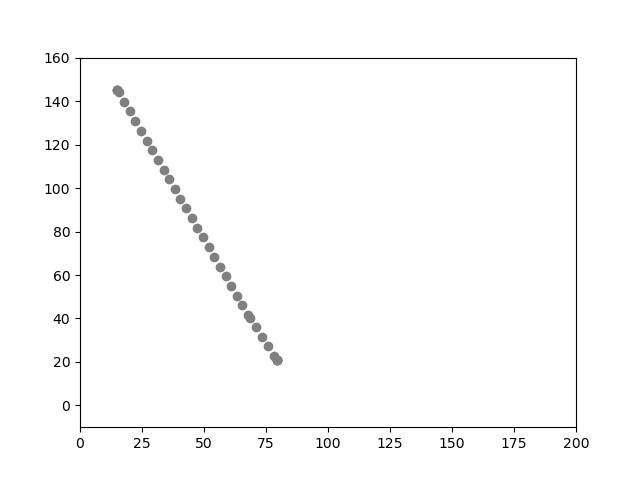
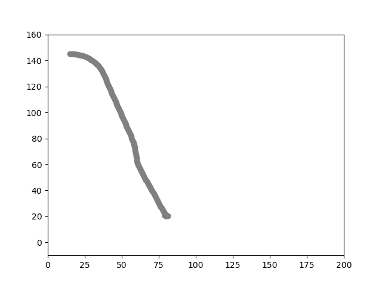

# Kinematic-Planning-under-Non-Holonomic-Conditions

The objective is to create a simulated world and park three vehicles into a compact space. The vehicle kinematics and collision need to be taken into consideration by the path planning algorithm. Kinematic planning under non-holonomic constraints have been used in this assignment for efficient parking of the vehicles. A* algorithm has been used as the planner algorithm for the cars in this project. The three vehicles implemented in this project are:

1)	A di-wheel configured delivery robot.
2)	A standard car using Ackermann’s steering principle.
3)	A truck with a trailer attached.

Set the project directory as the workspace,

`cd ./Kinematic-Planning-under-Non-Holonomic-Conditions`

To simulate the di-wheel delivery robot, 

`python main.py --robotType 1`

The simualation of the di-wheel delivery robot and the path taken is shown below:

  
   

To simulate the standard car using Ackermann's principle,

`python main.py --robotType 2`

The simualation of the standard car and the path taken is shown below:

  
   

To simulate the truck with a trailer attached, 

`python main.py --robotType 3`

The simualation of the truck and the path taken is shown below:

  
   

